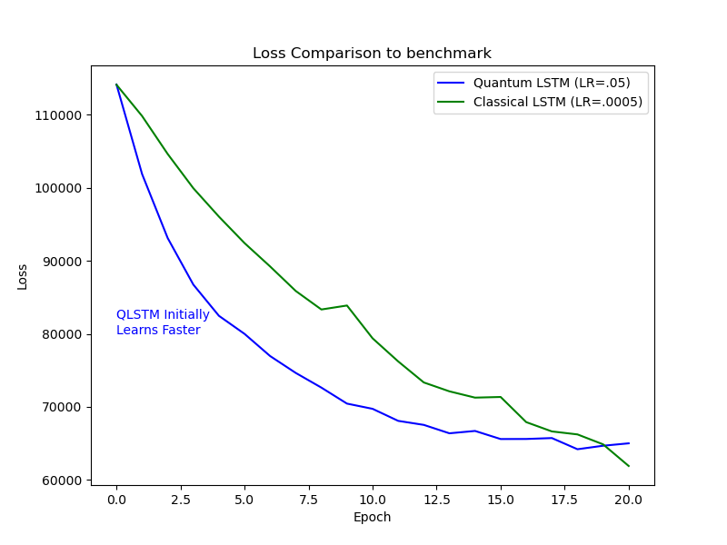

# Quantum Hybrid Neural Decoding

### In this project, the brain signals from a monkey are decoded by an LSTM with Variational Quantum Circuits. These results are compared against a classical LSTM to show that Quantum ML can learn in fewer epochs than the classical benchmark.

# Key Files: 

1. High-level Overview of Problem Statement & Findings --> [Overview.pdf](./Overview.pdf)
2. Main Notebook with walkthrough and visuals --> [Neural-Decoding.ipynb](./Neural-Decoding.ipynb)
3. Time Series Model Code including the QLSTM Cell --> [TSModels.py](./TSModels.py)

# Main Results

